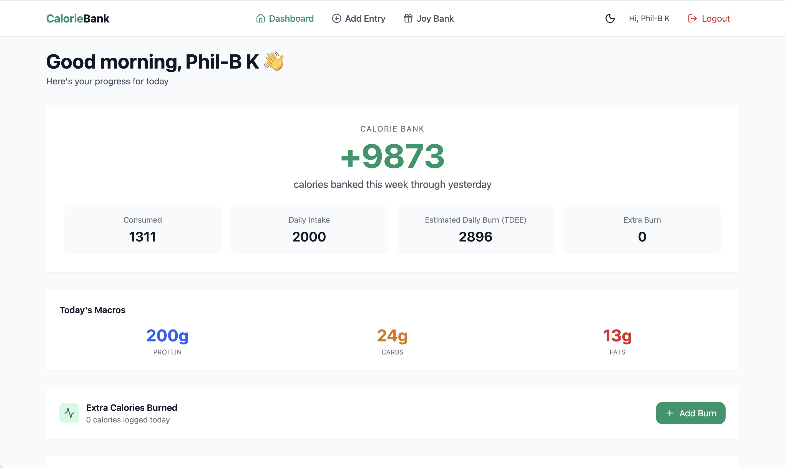
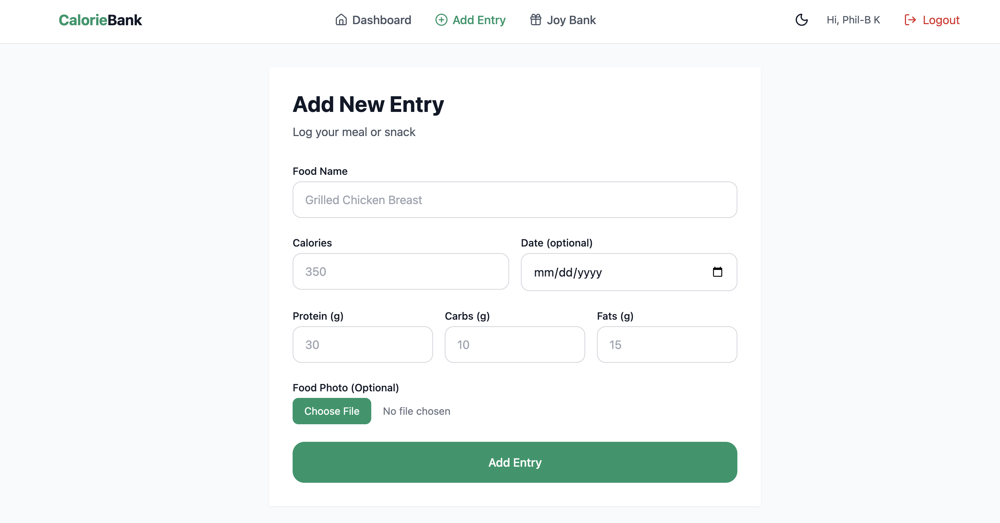
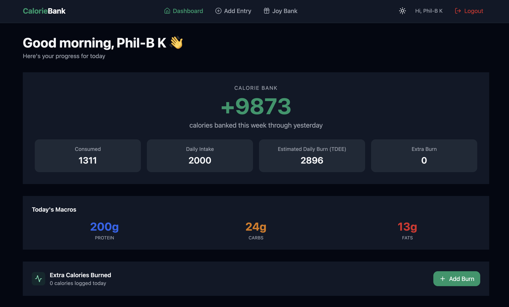
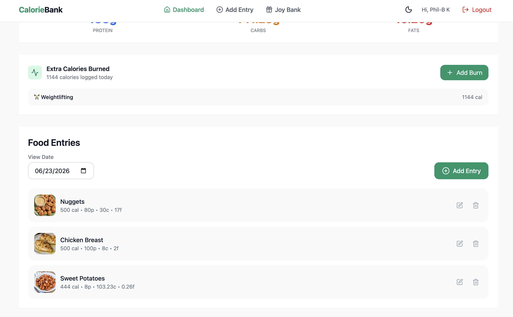
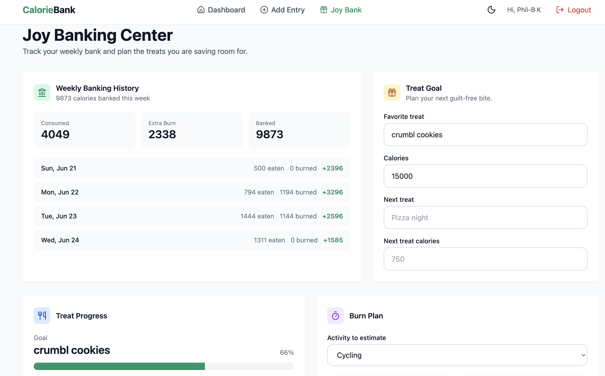

# CalorieBank

CalorieBank is a full-stack calorie tracking application built with React, Node.js, Express, and MongoDB that treats calories like a bank account, helping users save calories throughout the week for planned treats while staying on track with their nutrition goals.

## 🚀 Quick Links

🎥 **2-Minute Project Walkthrough**  
https://www.loom.com/share/3a0f06928e004bad80cd4ae181f65d1c

🌐 **Live Application**  
https://caloriebank-pi.vercel.app/

💻 **Source Code**  
This repository



CalorieBank is a full-stack calorie tracking application that treats calories like a **daily and weekly bank**. Instead of just logging what you eat, it calculates how many calories you have "banked" based on your personal TDEE, food intake, and extra activity.

The goal is to help users build a healthier, more positive relationship with food by giving them visibility into their calorie surplus or deficit over time.

---

## ✨ Features

- User authentication with JWT
- Personalized TDEE calculation (height, weight, age, sex, activity level)
- Daily food logging with macros (calories, protein, carbs, fats)
- Food photo uploads stored in AWS S3
- Automatic daily calorie bank calculation (`TDEE + extra burn - intake`)
- Weekly banking history and progress tracking
- Dark/Light mode support
- Responsive, modern UI with Tailwind CSS

---

## 🛠️ Tech Stack

**Frontend**
- React + Vite
- React Router
- Tailwind CSS
- Lucide React (icons)
- Context API for state management

**Backend**
- Node.js + Express
- MongoDB + Mongoose
- JWT Authentication
- AWS SDK (S3 photo uploads)
- bcrypt for password hashing

---

## Screenshots







---

## Architecture

CalorieBank/
├── backend/               # Express API
│   ├── controllers/       # Business logic
│   ├── middleware/        # JWT protection
│   ├── models/            # Mongoose schemas
│   ├── routes/            # Express route definitions
│   ├── utils/             # Shared date normalization
│   └── server.js          # Express app and MongoDB connection
├── frontend/
│   ├── src/components/    # Reusable UI sections
│   ├── src/context/       # Auth and food log state
│   ├── src/pages/         # Route-level screens
│   └── src/utils/api.js   # API client helper
└── DEPLOYMENT.md
```

## Getting Started

### Prerequisites

- Node.js `>=20.19.0`
- MongoDB Atlas or a local MongoDB connection string
- AWS S3 bucket and credentials if using food photo uploads

### Backend Setup

```sh
cd backend
npm install
cp .env.example .env
npm run dev
```

Required backend environment variables:

```env
MONGO_URI=
JWT_SECRET=
AWS_ACCESS_KEY_ID=
AWS_SECRET_ACCESS_KEY=
AWS_REGION=
AWS_BUCKET_NAME=
FRONTEND_URL=http://localhost:5173
PORT=4700
NODE_ENV=development
```

### Frontend Setup

```sh
cd frontend
npm install
cp .env.example .env
npm run dev
```

Required frontend environment variable:

```env
VITE_API_BASE_URL=http://localhost:4700
```

## API Overview

| Area | Method | Route | Purpose |
| --- | --- | --- | --- |
| Auth | `POST` | `/api/auth/register` | Create a user and return a JWT |
| Auth | `POST` | `/api/auth/login` | Authenticate a user |
| Food Logs | `GET` | `/api/foodlog?date=YYYY-MM-DD` | Get or create a daily log |
| Food Logs | `POST` | `/api/foodlog/entry` | Add a food entry |
| Food Logs | `PATCH` | `/api/foodlog/entry/:entryId` | Update an entry |
| Food Logs | `DELETE` | `/api/foodlog/entry/:entryId` | Delete an entry |
| Food Logs | `POST` | `/api/foodlog/burned` | Log extra burned calories |
| Bank | `GET` | `/api/foodlog/weekly-bank` | Get weekly banking history |
| Uploads | `POST` | `/api/upload/food-photo/:entryId` | Upload a food photo to S3 |

## What I Focused On

- Building a practical and positive calorie tracking experience
- Clean separation of concerns (controllers, routes, models, context)
- Proper date normalization for daily logs
- Secure file uploads with AWS S3
- Responsive design with dark mode support
- Production-ready deployment configuration

## Validation

Current checks:

```sh
cd frontend && npm run build
cd backend && node --check server.js
```

The production frontend build passes, and the backend entry file passes Node syntax validation.

## Deployment

See [DEPLOYMENT.md](./DEPLOYMENT.md) for hosting setup, environment variables, and deployment order.

## Future Improvements

- Food database with auto calorie lookup
- Password reset flow
- Weekly/monthly trend charts
- Unit tests
- Progressive Web App (PWA) support
